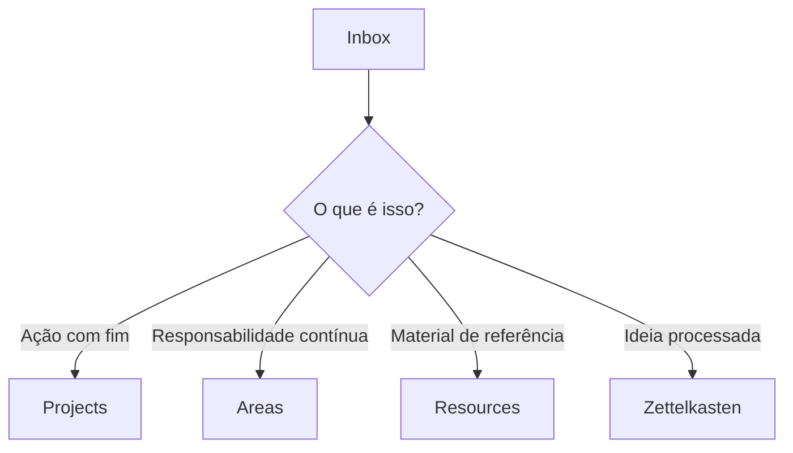
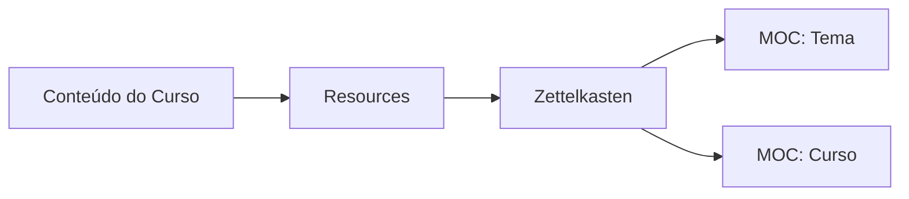

# para-zettel-obsidian

Um **template prático de vault para Obsidian** que combina o **método PARA** (Projects, Areas, Resources, Archive) com os princípios do **Zettelkasten** para gerenciar ações, responsabilidades, referências e conhecimento de longo prazo — **sem misturar os papéis de cada coisa**.

Este template foi pensado para ser:

* Simples de entender
* Fácil de manter ao longo dos anos
* Amigável para cursos, estudos e trabalho profissional
* Alinhado com a intenção original do PARA e do Zettelkasten

---

## O Que Este Template É (e o Que Ele Não É)

**Isso não é apenas um cofre de notas.**
É um **sistema de pensamento e ação**.

* O **PARA** organiza a informação pelo **que você faz**
* O **Zettelkasten** organiza a informação pelo **que você entende**
* Os **MOCs** organizam a informação por **como as ideias se conectam**

Cada parte tem **uma única responsabilidade**.
Sem sobreposição.

---

## 0. Extensões do Obsidian Utilizadas

Este vault utiliza um conjunto pequeno e opinativo de plugins. Cada um existe para dar suporte ao PARA, ao Zettelkasten ou ao trabalho de conhecimento de longo prazo.

Todas as extensões são ativadas automaticamente quando o vault é aberto e confiável.

* **Dataview** – Trata notas como dados estruturados
* **Templater** – Templates de arquivos e consistência
* **Kindle Highlights** – Importa destaques do Kindle
* **Obsidian Git** – Controle de versão e backups
* **Better Word Count** – Métricas precisas de escrita

---

## 1. Método PARA (Tiago Forte)

O PARA organiza a informação pela **acionabilidade**, não por assunto.

### Projects (Projetos)

* Objetivo claro e data de término
* Temporários

**Exemplos**

* Aprender uma música
* Lançar um site
* Concluir um curso

---

### Areas (Áreas)

* Responsabilidades contínuas
* Não têm data de fim

**Exemplos**

* Programação
* Finanças
* Música
* Saúde

> Áreas **não armazenam conteúdo**.
> Elas funcionam como **painéis de controle**.

---

### Resources (Recursos)

* Material de referência
* Organizado por tema
* Pode ser bruto ou não processado

**Exemplos**

* Vídeos
* Artigos
* PDFs
* Anotações de cursos

---

### Archive (Arquivo)

* Itens inativos
* Mantidos para referência histórica

---

## 2. Método Zettelkasten

O Zettelkasten é onde o **conhecimento vive**, independente de projetos ou cursos.

### Princípios Centrais

* **Atomicidade** – Uma ideia por nota
* **Conexões** – Notas formam uma rede
* **Com suas próprias palavras** – Nada de pensar por cópia
* **Independência de contexto** – A nota se sustenta sozinha

### Tipos de Notas

* Notas rápidas (fleeting notes)
* Notas de literatura
* Notas permanentes (o objetivo final)

---

## 3. MOCs (Maps of Content)

MOCs são **camadas de navegação**, não locais de armazenamento.

Eles respondem:

> “O que eu sei sobre este assunto?”

### Exemplos

* `MOC: Programação`
* `MOC: Git`
* `MOC: Finanças`
* `MOC: Curso.dev`

Uma nota pode (e geralmente deve) aparecer em **vários MOCs**.

---

## 4. Exemplo de Estrutura de Pastas

```
Obsidian Vault/
├── 0. Inbox/
├── 1. Projects/
├── 2. Areas/
├── 3. Resources/
│   ├── Programming/
│   ├── Finances/
│   └── Music/
├── 4. Archive/
├── MOCs/
├── Templates/
└── Zettelkasten/
```

---

## 5. O Fluxo Central do Sistema

### Fluxo em Alto Nível



---

### Regra da Inbox (Muito Importante)

> **Se você ainda não decidiu, fica na Inbox.**

A Inbox é sem atrito por definição.

---

## 6. Áreas vs MOCs (Distinção Crítica)

### Área = Responsabilidade

Pergunta:

> “O que eu preciso manter na minha vida?”

Exemplo: `2. Areas/Programming.md`

```markdown
# Área: Programação

## Responsabilidades
- Desenvolvimento profissional
- Aprendizado contínuo
- Qualidade de código

## Projetos Ativos
- [[Projeto X]]

## Cursos & Estudos
- [[MOC: Curso xpto]]

## Conhecimento
- [[MOC: Programação]]
```

---

### MOC = Mapa de Conhecimento

Pergunta:

> “O que eu sei sobre este tema?”

Exemplo: `MOCs/Git.md`

```markdown
# MOC: Git

- [[Git como Sistema de Histórico]]
- [[Commits Semânticos]]
- [[Estratégias de Branching]]
```

---

## 7. Cursos (Como Eles se Encaixam)

Cursos são **andaimes temporários**, não estrutura permanente.

### Estrutura recomendada

* Conteúdo do curso → `Resources`
* Ideias processadas → `Zettelkasten`
* Estrutura do curso → `MOC: Nome do Curso`
* A Área referencia o MOC do curso

### Visual



Com o tempo, **os MOCs por tema se tornam mais importantes do que os MOCs de curso**.

---

## 8. Critérios: Resources → Zettelkasten

Transforme um recurso em notas Zettelkasten quando:

1. Ele foi processado
2. Está escrito com suas próprias palavras
3. Contém apenas uma ideia
4. Pode se conectar a outras ideias
5. Não depende do contexto original

---

## 9. Exemplo: Vídeos e Web Clippings

* Vídeos não processados → `Inbox`
* Vídeos processados → `Resources/<Tema>`
* Ideias extraídas → `Zettelkasten`
* Navegação → MOCs

**Resources podem ficar para sempre.
O Zettelkasten é seletivo por natureza.**

---

## 10. Regras de Manutenção

* Projetos finalizados → Archive
* Cursos antigos → Archive (os Resources ficam se ainda forem úteis)
* Áreas raramente são arquivadas
* MOCs evoluem continuamente

---

## 11. Painel Operacional (My Tasks.md)

Este vault inclui um painel global opcional de tarefas localizado na raiz:

`My Tasks.md`

Este arquivo **não faz parte do PARA, Zettelkasten ou MOCs**.

Seu objetivo é funcionar como um **painel de execução diária**, agregando tarefas de todo o vault por meio de consultas Dataview.

### Princípios importantes

- As tarefas **vivem** nos Projetos, Áreas e notas
    
- Este arquivo **não deve armazenar tarefas manualmente**
    
- Ele apenas **exibe tarefas dinamicamente**
    
- Existe para reduzir fricção no planejamento diário
    

### Por que ele fica na raiz do vault

Porque ele é **transversal ao sistema**:

- Não pertence a um projeto específico
    
- Não é uma responsabilidade contínua (Área)
    
- Não é conhecimento (Zettelkasten)
    
- Não é material de referência (Recursos)
    

Ele é simplesmente um **centro de controle para ação**.

O usuário pode modificar ou remover este arquivo caso utilize outro sistema de gerenciamento de tarefas.

---

## Princípio Final

> **Projetos terminam.
> Áreas permanecem.
> Recursos informam.
> Zettelkasten pensa.
> MOCs conectam.**

Se cada parte fizer apenas o seu papel, o sistema permanece limpo por anos.

---

Boas reflexões.