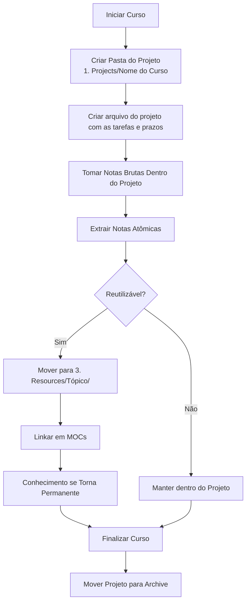

# para-zettel-obsidian

[English version](https://github.com/lmaoclost/para-zettel-obsidian/blob/main/README.md)

Um template prático de vault para Obsidian que combina PARA (Projetos, Áreas, Recursos, Arquivo) com o pensamento do Zettelkasten.

Este template é para quem quer separar execução de pensamento — sem fragmentar o próprio conhecimento.

Não é um experimento de produtividade.  
É um sistema de conhecimento e ação de longo prazo.

---

## TL;DR

- **Projetos** = coisas com prazo
- **Áreas** = responsabilidades contínuas
- **Recursos** = conhecimento reutilizável
- **Arquivo** = histórico concluído
- O Zettelkasten vive dentro de **Recursos**

Construa resultados em Projetos.  
Extraia conhecimento para Recursos.  
Arquive o restante.

---

## Menu

- [Filosofia Central](#filosofia-central)
- [A Estrutura](#a-estrutura)
- [Projetos](#1-projetos)
- [Áreas](#2-%C3%A1reas)
- [Recursos](#3-recursos)
- [MOCs](#mocs-maps-of-content)
- [Fluxo de Curso](#fluxo-de-curso-usando-para--zettelkasten)
- [Regras de Manutenção](#regras-de-manuten%C3%A7%C3%A3o)

---

# Filosofia Central

## O Sistema em Uma Frase

Projetos criam resultados.  
Áreas mantêm responsabilidades.  
Recursos constroem conhecimento.  
Arquivo preserva histórico.

PARA é infraestrutura.  
Zettelkasten é pensamento.

PARA responde:

> Onde isso pertence?

Zettelkasten responde:

> Como eu transformo isso em conhecimento reutilizável?

Eles resolvem problemas diferentes.

---

# A Estrutura

```
Obsidian Vault/
├── 0. Inbox/
├── 1. Projects/
├── 2. Areas/
├── 3. Resources/
├── 4. Archive/
└── Templates/
```

Não existe uma pasta chamada “Zettelkasten”.

O Zettelkasten é implementado dentro de Recursos.

---

# 0. Inbox

Capture primeiro.  
Organize depois.

Se você ainda não sabe o que algo é, ele fica aqui.

---

# 1. Projetos

Esforços ativos com um resultado claro.

Exemplos:

- Finalizar o rascunho de um romance
- Concluir um curso de programação
- Lançar um site

Se não existe linha de chegada, não é um projeto.

Quando terminar → mover para Arquivo.

Projetos produzem resultados.

---

# 2. Áreas

Responsabilidades contínuas, sem data final.

Exemplos:

- Programação
- Escrita
- Saúde
- Finanças

Áreas não são pastas de armazenamento.  
São painéis de controle.

Podem conter:

- Padrões
- Checklists
- Links para projetos ativos
- Links para hubs de conhecimento

Áreas mantêm qualidade ao longo do tempo.

---

# 3. Recursos

Conhecimento reutilizável e material de referência.

É aqui que vivem as notas do Zettelkasten.

Se algo é:

- Reutilizável
- Não está preso a um único projeto
- Escrito com suas próprias palavras
- Atômico
- Conectável

Então pertence aqui.

Estrutura exemplo:

```
3. Resources/
├── Programming/
├── Writing/
└── Finance/
```

Recursos são ativos.

---

# 4. Arquivo

Histórico concluído.

Projetos finalizados.  
Cursos antigos.  
Material inativo.

Você mantém o registro.  
Remove o ruído.

---

# MOCs (Mapas de Conteúdo)

Os MOCs vivem dentro de Recursos.

São camadas de navegação.

Respondem:

> O que eu sei sobre este tema?

Eles não armazenam conhecimento.  
Eles conectam conhecimento.

Uma nota pode aparecer em vários MOCs. Isso é esperado.

---

# Zettelkasten Dentro Deste Sistema

## Fluxo de Curso (Usando PARA + Zettelkasten)

Um curso é um Projeto.  
O conhecimento extraído dele pertence aos Recursos.



### Fluxo Prático

1. Faça anotações bagunçadas dentro do Projeto.
2. Quando uma ideia ficar clara, reescreva como nota atômica.
3. Mova para Recursos.
4. Conecte em um MOC.
5. Quando o curso terminar, arquive o Projeto.

Um curso é temporário.  
Conhecimento é permanente.

---

# Painel Operacional (Opcional)

Você pode incluir um arquivo na raiz como:

```
My Tasks.md
```

Ele não armazena tarefas.  
Ele agrega tarefas dinamicamente (por exemplo, usando Dataview).

As tarefas vivem dentro de Projetos e Áreas.

O painel reduz fricção durante a execução.

---

# Regras de Manutenção

- Projetos finalizados → Arquivo
- Cursos antigos → Arquivo
- Áreas podem evoluir, mas raramente mudam de lugar
- Recursos crescem de forma deliberada
- MOCs evoluem quando necessário

Não organize demais no início.

Deixe a estrutura emergir com o uso.

---

# Princípio Final

Projetos produzem resultados.  
Áreas mantêm padrões.  
Recursos constroem conhecimento.  
Arquivo preserva histórico.

Clareza escala.  
Confusão se acumula.

Este sistema foi construído para clareza.