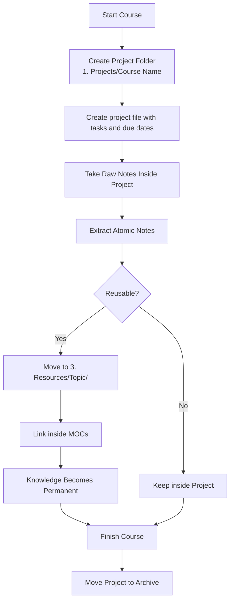

# para-zettel-obsidian

[Portuguese version](https://github.com/lmaoclost/para-zettel-obsidian/blob/main/LEIAME.md)

A practical Obsidian vault template that combines PARA (Projects, Areas, Resources, Archive) with Zettelkasten thinking.

This template is for people who want to separate execution from thinking — without fragmenting their knowledge.

This is not a productivity experiment.  
It is a long-term knowledge and action system.

---

## TL;DR

- **Projects** = things with deadlines
- **Areas** = ongoing responsibilities
- **Resources** = reusable knowledge
- **Archive** = completed history
- Zettelkasten lives inside **Resources**

Build outcomes in Projects.  
Extract knowledge into Resources.  
Archive the rest.

---

## Menu

- [Core Philosophy](#core-philosophy)
- [The Structure](#the-structure)
- [Projects](#1-projects)
- [Areas](#2-areas)
- [Resources](#3-resources)
- [MOCs](#mocs-maps-of-content)
- [Course Workflow](#course-workflow-using-para--zettelkasten)
- [Maintenance Rules](#maintenance-rules)

---

# Core Philosophy

## System in One Sentence

Projects create outcomes.  
Areas maintain responsibilities.  
Resources build knowledge.  
Archive preserves history.

PARA is infrastructure.  
Zettelkasten is thinking.

PARA answers:

> Where does this belong?

Zettelkasten answers:

> How do I turn this into reusable knowledge?

They solve different problems.

---

# The Structure

```
Obsidian Vault/
├── 0. Inbox/
├── 1. Projects/
├── 2. Areas/
├── 3. Resources/
├── 4. Archive/
└── Templates/
```

There is no “Zettelkasten” folder.

Zettelkasten is implemented inside Resources.

---

# 0. Inbox

Capture first.  
Organize later.

If you don’t know what something is yet, it stays here.

---

# 1. Projects

Active efforts with a clear outcome.

Examples:

- Finish a novel draft
- Complete a programming course
- Launch a website

If there is no finish line, it is not a project.

When finished → move to Archive.

Projects produce results.

---

# 2. Areas

Ongoing responsibilities with no end date.

Examples:

- Programming
- Writing
- Health
- Finances

Areas are not storage folders.  
They are control panels.

They may contain:

- Standards
- Checklists
- Links to active projects
- Links to knowledge hubs

Areas maintain quality over time.

---

# 3. Resources

Reusable knowledge and reference material.

This is where Zettelkasten notes live.

If something is:

- Reusable
- Not tied to one project
- Written in your own words
- Atomic
- Linkable

It belongs here.

Example structure:

```
3. Resources/
├── Programming/
├── Writing/
└── Finance/
```

Resources are assets.

---

# 4. Archive

Completed history.

Finished projects.  
Old courses.  
Inactive material.

You keep the record.  
You remove the noise.

---

# MOCs (Maps of Content)

MOCs live inside Resources.

They are navigation layers.

They answer:

> What do I know about this topic?

They do not store knowledge.  
They link knowledge.

A note can appear in multiple MOCs. That is expected.

---

# Zettelkasten in This System

## Course Workflow (Using PARA + Zettelkasten)

A course is a Project.  
The knowledge extracted from it belongs in Resources.



### Practical Flow

1. Take messy notes inside the Project.
2. When an idea becomes clear, rewrite it as an atomic note.
3. Move it to Resources.
4. Link it in a MOC.
5. When the course ends, archive the Project.

A course is temporary.  
Knowledge is permanent.

---

# Operational Dashboard (Optional)

You may include a root file like:

```
My Tasks.md
```

It does not store tasks.  
It aggregates tasks dynamically (e.g., with Dataview).

Tasks live inside Projects and Areas.

The dashboard reduces friction during execution.

---

# Maintenance Rules

- Finished Projects → Archive
- Old courses → Archive
- Areas may evolve, but rarely move
- Resources grow deliberately
- MOCs evolve when needed

Do not over-organize early.

Let structure emerge from use.

---

# Final Principle

Projects produce results.  
Areas maintain standards.  
Resources build knowledge.  
Archive preserves history.

Clarity scales.  
Confusion compounds.

This system is built for clarity.