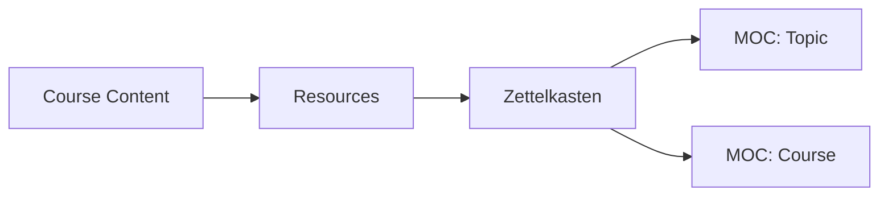

# para-zettel-obsidian

A practical **Obsidian vault template** that combines the **PARA method** (Projects, Areas, Resources, Archive) with **Zettelkasten** principles to manage actions, responsibilities, references, and long-term knowledge — without mixing their roles.

This template is meant to be:
- Simple to understand
- Easy to maintain over years
- Friendly to courses, studies, and professional work
- Aligned with how PARA and Zettelkasten were originally intended

---

## What This Template Is (and Is Not)

**This is not just a notes vault.**  
It is a **thinking and action system**.

- PARA organizes information by **what you do**
- Zettelkasten organizes information by **what you understand**
- MOCs organize information by **how ideas connect**

Each part has a single responsibility. No overlap.

---

## 0. Obsidian Extensions Used

This vault relies on a small, opinionated set of plugins. Each one exists to support PARA, Zettelkasten, or long-term knowledge work.

All extensions are automatically enabled when the vault is opened and trusted.

- **Dataview** – Treat notes as structured data
- **Templater** – File templates and consistency
- **Kindle Highlights** – Import highlights from Kindle
- **Obsidian Git** – Version control and backups
- **Better Word Count** – Accurate writing metrics

---

## 1. PARA Method (Tiago Forte)

PARA organizes information by **actionability**, not by topic.

### Projects
- Clear goal and end date
- Temporary

**Examples**
- Learn a song
- Launch a website
- Finish a course

---

### Areas
- Ongoing responsibilities
- No end date

**Examples**
- Programming
- Finances
- Music
- Health

> Areas do not store content.  
> They act as **control panels**.

---

### Resources
- Reference material
- Organized by topic
- Can be raw or unprocessed

**Examples**
- Videos
- Articles
- PDFs
- Course notes

---

### Archive
- Inactive items
- Kept for historical reference

---

## 2. Zettelkasten Method

Zettelkasten is where **knowledge lives**, independent of projects or courses.

### Core Principles
- **Atomicity** – One idea per note
- **Connections** – Notes form a network
- **Own words** – No copy-paste thinking
- **Context independence** – Notes stand alone

### Types of Notes
- Fleeting notes
- Literature notes
- Permanent notes (the goal)

---

## 3. MOCs (Maps of Content)

MOCs are **navigation layers**, not storage.

They answer:
> “What do I know about this topic?”

### Examples
- `MOC: Programming`
- `MOC: Git`
- `MOC: Finances`
- `MOC: Course.dev`

A note can (and often should) appear in **multiple MOCs**.

---

## 4. Folder Structure Example

```
Obsidian Vault/
├── 0. Inbox/
├── 1. Projects/
├── 2. Areas/
├── 3. Resources/
│   ├── Programming/
│   ├── Finances/
│   └── Music/
├── 4. Archive/
├── MOCs/
├── Templates/
└── Zettelkasten/
````

---

## 5. The Core Workflow

### High-Level Flow

```mermaid
flowchart TD
    A[Inbox] --> B{What is this?}
    B -->|Action with end| C[Projects]
    B -->|Ongoing responsibility| D[Areas]
    B -->|Reference material| E[Resources]
    B -->|Processed idea| F[Zettelkasten]
````

---

### Inbox Rule (Very Important)

> **If you haven't decided yet, it stays in Inbox.**

Inbox is frictionless by design.

---

## 6. Areas vs MOCs (Critical Distinction)

### Area = Responsibility

Asks:

> “What do I need to maintain in my life?”

Example: `2. Areas/Programming.md`

```markdown
# Area: Programming

## Responsibilities
- Professional development
- Continuous learning
- Code quality

## Active Projects
- [[Project X]]

## Courses & Study
- [[MOC: Course xpto]]

## Knowledge
- [[MOC: Programming]]
```

---

### MOC = Knowledge Map

Asks:

> “What do I know about this topic?”

Example: `MOCs/Git.md`

```markdown
# MOC: Git

- [[Git as a History System]]
- [[Semantic Commits]]
- [[Branching Strategies]]
```

---

## 7. Courses (How They Fit)

Courses are **temporary scaffolding**, not permanent structure.

### Recommended setup

- Course materials → `Resources`
    
- Processed ideas → `Zettelkasten`
    
- Course structure → `MOC: Course Name`
    
- Area references the course MOC
    

### Visual



Over time, **topic MOCs matter more than course MOCs**.

---

## 8. Resources → Zettelkasten Criteria

Turn a resource into Zettelkasten notes when:

1. It was processed
    
2. Written in your own words
    
3. One idea per note
    
4. Can connect to other ideas
    
5. Does not depend on the original context
    

---

## 9. Example: Videos and Web Clippings

- Unprocessed videos → `Inbox`
    
- Processed videos → `Resources/<Topic>`
    
- Ideas extracted → `Zettelkasten`
    
- Navigation → MOCs
    

**Resources are allowed to stay forever.  
Zettelkasten is selective by design.**

---

## 10. Maintenance Rules

- Finished projects → Archive
    
- Old courses → Archive (Resources stay if useful)
    
- Areas rarely archived
    
- MOCs evolve continuously
    

---

## 11. Operational Dashboard (My Tasks.md)

This vault includes an optional global task dashboard located at the vault root:

```
My Tasks.md
```

This file is **not part of PARA, Zettelkasten, or MOCs**.

Its purpose is to act as a **daily execution panel**, aggregating tasks from the entire vault using Dataview queries.

### Key Principles

- Tasks **live** inside Projects, Areas, and notes
    
- This file **does not store tasks manually**
    
- It only **displays tasks dynamically**
    
- It exists to reduce friction in daily planning
    

### Why it stays at the vault root

Because it is **cross-functional**:

- It does not belong to a single project
    
- It is not an Area (ongoing responsibility)
    
- It is not knowledge (Zettelkasten)
    
- It is not reference material (Resources)
    

It is simply a **control center for action**.

Users may modify or remove this file if they prefer another task management system.

---

## Final Principle

> **Projects end.  
> Areas persist.  
> Resources inform.  
> Zettelkasten thinks.  
> MOCs connect.**

If each part does only its job, the system stays clean for years.

---

Happy thinking.